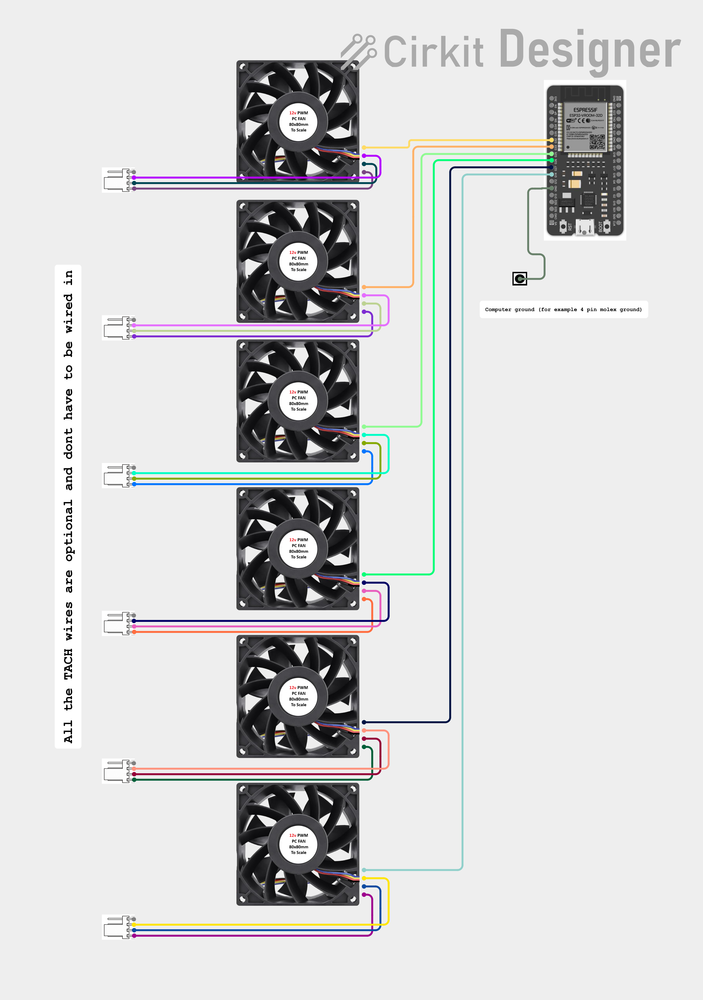
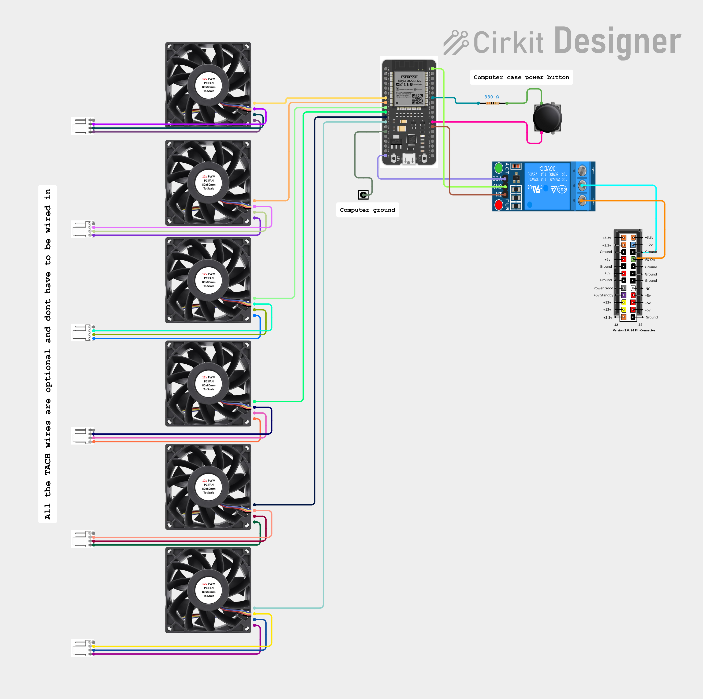

# ESP32 based PWM fan controller

This project came about what I got my hands on a Dell server, which I used to replace my old NAS in my homelab. For obvious reasons, Dell blocks you from setting the fan speed low enough for the server to be quiet.

I went ahead and replaced the stock fans with a bit quieter ones but it was still not quiet enough for my liking, so I went with a full DIY option and put together a ESP32 based PWM fan controller that bypasses All of this and lets you set the fan speed to whatever you want.

Later on I have also put together a more feature rich version for use with my AMD BC250 Project, I was working on at the time. This version also includes a power button functionality, hooked to a relay, that lets you use a PC case power button to turn on the power supply and thus turning the BC250 on.

I will be posting 3 versions on here. 
1. Basic PWM controller with WEB UI (mostly for testing)
2. PWM controller with WEB UI and API functionality
3. BC250 version that includes the powerbutton functionality also


## 1. Requirements

**Standard version**
1. Wifi equiped ESP32 board
    * I am currently using a ESP32-DevKitV1 30pin USB-C

2. USB micro / USB C cable, to power the board by the computer you are trying to cool down.
    * deppends on your board
3. Cabling needed to connect a ground to the computer, and enough cables to connect all the fans you are trying to control.
    * In case of my code, this is built to control 6 fans

**BC250 specific version**
1. independent power supply for the ESP32, You can use a random phone charger you have on hand.
    * this is important as you wont be able to power the board from a computer that is turned off...
2. A relay that can be powered by the ESP32, I am using a 5V version meant for an arduino, but I cant promise it will work with all ESP32 boards.
3. Enough cabling to connect your ground and fan wires but also the Relay and power buttons.

4. 330 ohm resistor (or more it doesnt really matter)

* Optional
    * A bread board
    * A 3D printed case
    * Wago splicing connector to make dealing with ground easier


## 2. Wiring
Standard version - 

* PWM fan pins - 32, 14, 25, 26, 27, 33
* GND
    * Ground needs to be shared with the computer for PWM to function reliably. (Just jam a cable into a ground pin on a spare molex connector)


BC250 version - 

* PWM fan pins - 32, 14, 25, 26, 27, 33
* GND
    1. Pin for PWM reference
    2. Pin for the power button
    3. Ground for the relay
    * a wago splicing connector can be used here to share a couple grounds together

* Relay pins
    * 3.3v from the board
    * Pin 4 to control the relay

* Button pins
    * Pin 16 to one end of the button




## 3. What to change before flashing the code

1. Change the Wifi settings - 

```
// --------------------
// WIFI

const char* ssid = "YOUR_SSID_HERE";
const char* password = "YOUR_WIFI_PASSWORD_HERE";
```
2. Change the API key 

```
// --------------------
// API KEY

// Change this before deploying
const char* API_KEY = "CHANGE_ME_SECRET_KEY";
```
3. Change the default fan speed
```
// --------------------
// DEFAULT fan speed

#define DEFAULT_FAN_PERCENT 50
```
## 4. Using the API

Example using curl replace <ESP32_IP> with the devices actual IP address (check the serial monitor output at boot)

```
curl "http://<ESP32_IP>/api/all?value=100&key=CHANGE_ME_SECRET_KEY"
```
Swap "CHANGE_ME_SECRET_KEY" for whatever you actually set API_KEY to in the code. 
This only takes effect if the ESP32 is currently in API mode (default behaviour)

To target a single fan instead use this 

```
curl "http://<ESP32_IP>/api/fan?id=2&value=100&key=CHANGE_ME_SECRET_KEY"
```
(fan IDs are 0-indexed, so fan 3 in the UI = id=2).


If your server-side script is PowerShell instead of bash, the equivalent is:
```
Invoke-RestMethod "http://<ESP32_IP>/api/all?value=100&key=CHANGE_ME_SECRET_KEY"
```


Example of a code I am using on my Truenas server to give me automatic fan curve functionality - 

```
#!/bin/bash

# TrueNAS CPU Fan Controller
# Uses CPU package temperature and controls PWM fan speed via API


# -----------------------------
# Configuration

API_URL="http://X.X.X.X/api/all"
API_KEY="ARandomAPIkeyforthesakeofgithubshowcase"

CHECK_INTERVAL=10

HISTORY_SIZE=6        # 6 samples x 10 seconds = 60 second average

MIN_SPEED=25
MAX_SPEED=80

CURRENT_SPEED=25

TEMP_HISTORY=()


# -----------------------------
# Get CPU temperature

get_temp() {

    sensors | awk '
        /Package id 0:/ {
            gsub(/[+°C]/,"",$4)
            print int($4)
            exit
        }'
}


# -----------------------------
# Calculate average temperature


average_temp() {

    local sum=0

    for t in "${TEMP_HISTORY[@]}"; do
        sum=$((sum+t))
    done

    echo $((sum / ${#TEMP_HISTORY[@]}))
}


# -----------------------------
# Smooth fan curve
#
#  <=52C  : 25%
#  55C    : 31%
#  60C    : 41%
#  65C    : 51%
#  70C    : 80%
#
# -----------------------------

fan_curve() {

    local temp=$1


    if (( temp <= 52 )); then

        echo 25


    elif (( temp <= 55 )); then

        # 52-55C : 25-31%
        echo $((25 + (temp-52)*2))


    elif (( temp <= 60 )); then

        # 55-60C : 31-41%
        echo $((31 + (temp-55)*2))


    elif (( temp <= 65 )); then

        # 60-65C : 41-51%
        echo $((45 + (temp-60)*2))


    elif (( temp <= 70 )); then

        # 65-70C : 51-80%
        echo $((55 + (temp-65)*6))


    else

        echo 80

    fi
}


# -----------------------------
# Limit fan speed changes


limit_change() {

    local target=$1
    local current=$2


    # Fan increasing
    if (( target > current )); then

        if (( target > current + 5 )); then
            echo $((current+5))
        else
            echo "$target"
        fi


    # Fan decreasing
    elif (( target < current )); then

        if (( target < current - 3 )); then
            echo $((current-3))
        else
            echo "$target"
        fi


    else

        echo "$current"

    fi
}


# -----------------------------
# Send fan command


set_fan() {

    local speed=$1

    curl -s \
    "${API_URL}?value=${speed}&key=${API_KEY}" \
    >/dev/null
}


# -----------------------------
# Main loop


echo "TrueNAS fan controller started"


while true
do

    TEMP=$(get_temp)


    if [[ -z "$TEMP" ]]; then

        echo "Unable to read CPU temperature"

        sleep "$CHECK_INTERVAL"

        continue

    fi


    # Add temperature sample

    TEMP_HISTORY+=("$TEMP")


    # Keep only last N samples

    if (( ${#TEMP_HISTORY[@]} > HISTORY_SIZE )); then

        TEMP_HISTORY=("${TEMP_HISTORY[@]:1}")

    fi


    AVG_TEMP=$(average_temp)


    TARGET_SPEED=$(fan_curve "$AVG_TEMP")


    NEW_SPEED=$(limit_change "$TARGET_SPEED" "$CURRENT_SPEED")


    if (( NEW_SPEED != CURRENT_SPEED )); then

        echo "$(date '+%F %T') CPU:${TEMP}C AVG:${AVG_TEMP}C FAN:${NEW_SPEED}%"

        set_fan "$NEW_SPEED"

        CURRENT_SPEED=$NEW_SPEED

    else

        echo "$(date '+%F %T') CPU:${TEMP}C AVG:${AVG_TEMP}C FAN:${CURRENT_SPEED}%"

    fi


    sleep "$CHECK_INTERVAL"

done
```
